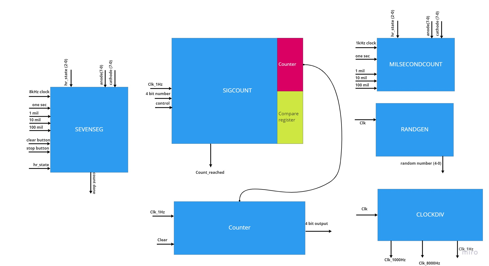
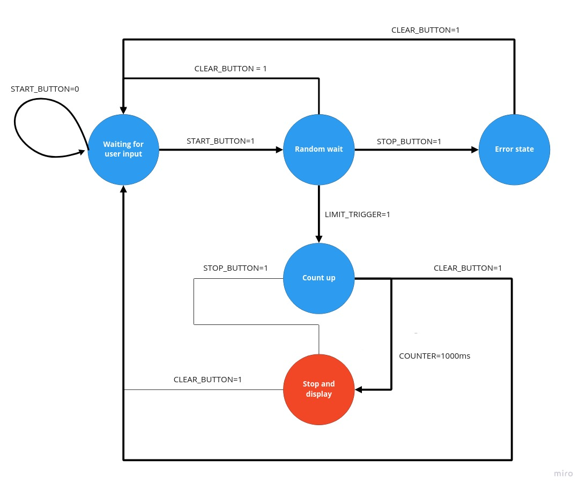
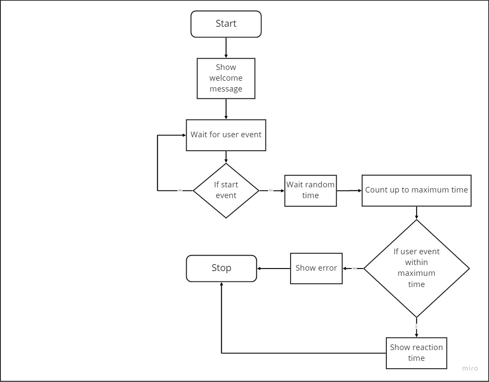

# human-reaction-test-vhdl
Use an FPGA to code the logic for getting the human reaction time to visual
stimulus. Archie Dakin and myself did this in VHDL on the Xilinx Nexsys4.
Doughlas Agho helped with a little documentation.

When you press the start button, the system waits a random time between 2
and 15s, turns on an LED for a maximum of 1s, and waits for you to press
a button within that time.

The goal is to press the button as soon as you see the LED. We found that
humans typically have a reaction time of 200 - 400 milliseconds.

This [video](demo/vhdl-demo.mp4) shows you the end result.

Schematics [here](rtl_schematic.pdf).

Test bench and simulations [here](./Schematics/).

[Nexys-4-DDR-Master.xdc](./Nexys-4-DDR-Master.xdc) is the constraint file
for the Nexys4 DDR used on Xilinx Vivado IDE.

## Architecture

.

